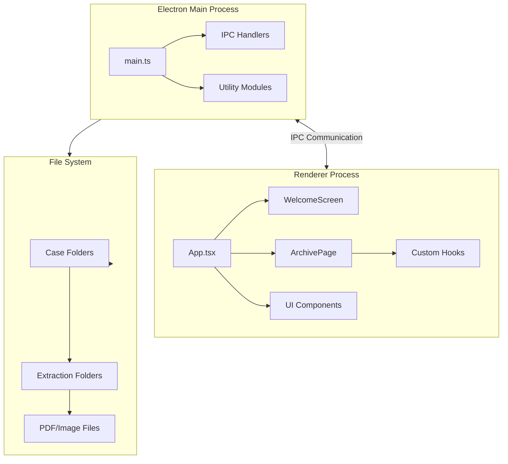
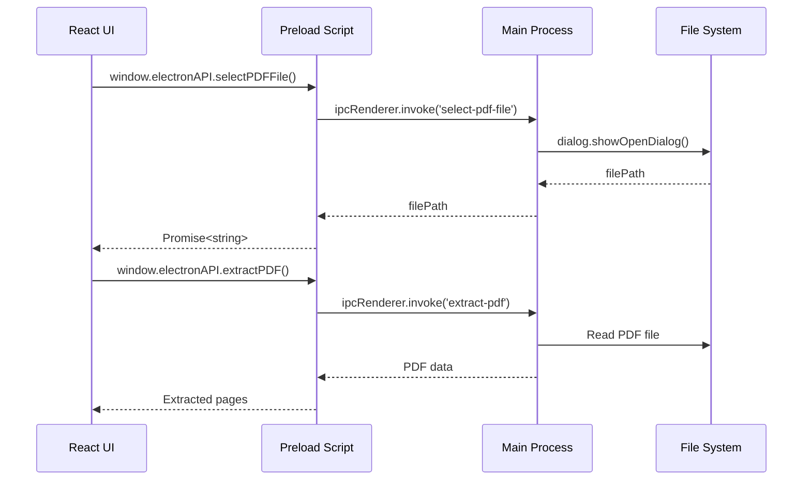
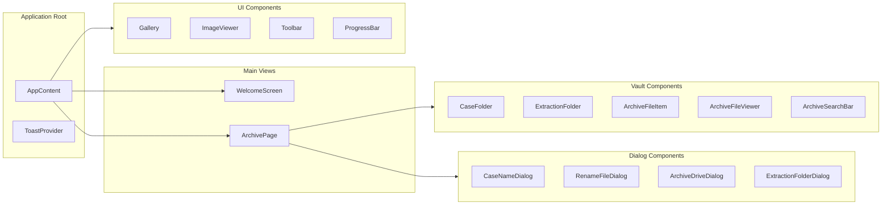

# The Vault

**A Professional Research Organization Tool**

[](https://www.typescriptlang.org/)
[](https://reactjs.org/)
[](https://www.electronjs.org/)
[](LICENSE)

The Vault is a powerful desktop application designed for researchers, investigators, and professionals who need to organize, extract, and manage PDF documents systematically. Built with Electron and React, it provides a modern, intuitive interface for converting PDF pages to PNG images and organizing them within a structured case-based filing system.

## Table of Contents

- [Features](#features)
- [Architecture](#architecture)
- [Installation & Setup](#installation--setup)
- [Usage Guide](#usage-guide)
- [Technical Details](#technical-details)
- [Development](#development)
- [License](#license)

## Features

### PDF Extraction
- **High-Quality Conversion**: Extract individual pages from PDF documents as PNG images
- **Batch Processing**: Process entire PDFs with real-time progress tracking
- **Flexible Output**: Save extracted pages to custom directories or ZIP archives
- **Parent File Preservation**: Option to save the original PDF alongside extracted pages

### The Vault - Research Organization System
- **Case-Based Organization**: Create and manage case files for organizing research projects
- **Extraction Folders**: Automatically organize PDF extractions within case folders
- **Hierarchical Structure**: Navigate through nested folders with breadcrumb navigation
- **File Management**: 
  - Rename files and folders with inline editing
  - Delete files and folders with confirmation dialogs
  - Search across cases and files
  - Drag and drop file uploads

### File Viewing & Management
- **Thumbnail Generation**: Automatic thumbnail generation for images, PDFs, and videos
- **Full-Screen Viewer**: View files in a dedicated viewer with navigation controls
- **File Type Detection**: Automatic categorization of files (images, PDFs, videos, other)
- **Metadata Tracking**: File size, modification dates, and parent PDF relationships

### User Experience
- **Modern UI**: Cyberpunk-themed interface with smooth animations
- **Real-Time Feedback**: Toast notifications and progress bars
- **Responsive Design**: Adapts to different screen sizes
- **Keyboard Shortcuts**: Enter to confirm, Escape to cancel in dialogs

## Architecture

### Tech Stack

- **Frontend**: React 18.2, TypeScript 5.3, TailwindCSS, Framer Motion
- **Backend**: Electron 28.1, Node.js
- **PDF Processing**: PDF.js 3.11
- **Image Processing**: Sharp 0.33
- **Build Tools**: Vite 5.0, Electron Builder

### Application Structure



### IPC Communication Flow



### Component Architecture



## Installation & Setup

### Prerequisites

- **Node.js**: Version 20.x or higher
- **npm**: Version 9.x or higher (comes with Node.js)
- **Git**: For cloning the repository

### Development Setup

1. **Clone the repository**
   ```bash
   git clone https://github.com/yourusername/the-vault.git
   cd the-vault
   ```

2. **Install dependencies**
   ```bash
   npm install
   ```

3. **Run in development mode**
   ```bash
   npm run electron:dev
   ```
   This command will:
   - Build the Electron main process
   - Start the Vite dev server
   - Launch the Electron application

4. **Development scripts**
   ```bash
   # Build Electron main process only
   npm run build:electron
   
   # Build React frontend only
   npm run build
   
   # Build both
   npm run build:all
   
   # Preview production build
   npm run preview
   ```

### Production Build

1. **Build for all platforms**
   ```bash
   npm run electron:build
   ```

2. **Platform-specific builds**
   - **Windows**: Creates an NSIS installer in `release/`
   - **macOS**: Creates a DMG file in `release/`
   - **Linux**: Creates an AppImage in `release/`

3. **Build output**
   - Compiled files: `dist/` (frontend) and `dist-electron/` (main process)
   - Installers: `release/`

### Project Structure

```
the-vault/
├── electron/                 # Electron main process
│   ├── main.ts              # Main entry point
│   ├── preload.ts           # Preload script (IPC bridge)
│   └── utils/               # Utility modules
│       ├── archiveConfig.ts # Vault configuration
│       ├── pathValidator.ts # Path validation
│       ├── pdfExtractor.ts  # PDF processing
│       └── thumbnailGenerator.ts # Thumbnail generation
├── src/                      # React application
│   ├── components/          # React components
│   │   ├── Archive/        # Vault-specific components
│   │   ├── Toast/          # Toast notification system
│   │   └── ...             # Other UI components
│   ├── hooks/              # Custom React hooks
│   │   ├── useArchive.ts   # Vault management
│   │   ├── useArchiveExtraction.ts # Vault PDF extraction
│   │   └── usePDFExtraction.ts # Standard PDF extraction
│   ├── types/              # TypeScript type definitions
│   └── utils/              # Utility functions
├── dist/                    # Built frontend (generated)
├── dist-electron/          # Built Electron main (generated)
└── release/                 # Production installers (generated)
```

## Usage Guide

### Getting Started

1. **Launch The Vault**
   - Run the application from your desktop or command line
   - You'll see the welcome screen with two options:
     - **Select file**: Extract pages from a PDF
     - **The Vault**: Access your research organization system

### PDF Extraction Workflow

1. **Select a PDF File**
   - Click "Select file" on the welcome screen
   - Choose a PDF file from your file system
   - Extraction begins automatically

2. **Monitor Progress**
   - Watch the progress bar for extraction status
   - View real-time status messages
   - See extracted pages appear in the gallery

3. **Save Extracted Pages**
   - Select a save directory
   - Choose save options:
     - **Save parent file**: Include the original PDF
     - **Save to ZIP**: Package everything in a ZIP archive
     - **Folder name**: Organize in a named folder
   - Click "Save" to export

### The Vault - Research Organization

#### Setting Up Your Vault

1. **Select Vault Drive**
   - Click "The Vault" from the welcome screen
   - First time: Select a directory to store your vault
   - This location is remembered for future sessions

2. **Create a Case File**
   - Click "Start Case File" button
   - Enter a case name (e.g., "Research Project 2024")
   - The case folder is created in your vault directory

#### Organizing Research Materials

1. **Add Files to a Case**
   - Open a case by clicking on it
   - Click "Add Files" or drag and drop files
   - Files are copied into the case folder

2. **Extract PDFs Within Cases**
   - Click on a PDF file in your case
   - Click the play button or PDF options dropdown
   - Choose extraction settings:
     - Create new extraction folder
     - Name the folder
     - Option to save parent PDF
   - Extraction runs and pages are saved to the folder

3. **Navigate Your Vault**
   - Use breadcrumb navigation to move between folders
   - Click folders to open them
   - Use "Back" buttons to navigate up the hierarchy

#### File Management

1. **Rename Files/Folders**
   - Hover over a file or folder
   - Click the pencil icon
   - Enter new name and press Enter or click Confirm

2. **Delete Files/Folders**
   - Hover over a file or folder
   - Click the trash icon
   - Confirm deletion in the dialog

3. **Search**
   - Use the search bar to find files or cases
   - Search works across case names and file names
   - Results update in real-time

4. **View Files**
   - Click on any file to open the viewer
   - Use arrow keys or buttons to navigate between files
   - Press Escape to close the viewer

### Best Practices for Research Organization

1. **Case Structure**
   - Create separate cases for different research projects
   - Use descriptive case names
   - Keep related materials together

2. **Extraction Folders**
   - Name extraction folders descriptively
   - Group related PDF extractions
   - Use consistent naming conventions

3. **File Organization**
   - Keep original PDFs alongside extractions
   - Use folders to separate different document types
   - Regularly review and organize your vault

## Technical Details

### Key Components

#### Main Process (`electron/main.ts`)
- Handles all file system operations
- Manages IPC communication
- Validates paths and file operations
- Processes PDF extractions
- Generates thumbnails

#### Preload Script (`electron/preload.ts`)
- Bridges renderer and main processes
- Exposes safe Electron APIs to React
- Type-safe IPC communication

#### React Application (`src/App.tsx`)
- Main application component
- Manages routing between views
- Coordinates PDF extraction and Vault access

#### Custom Hooks

**`usePDFExtraction`** (`src/hooks/usePDFExtraction.ts`)
- Manages PDF extraction state
- Handles PDF.js integration
- Provides progress updates
- Returns extracted pages

**`useArchive`** (`src/hooks/useArchive.ts`)
- Manages Vault state and operations
- Handles case and file management
- Provides search functionality
- Manages thumbnail caching

**`useArchiveExtraction`** (`src/hooks/useArchiveExtraction.ts`)
- Specialized PDF extraction for Vault
- Integrates with case folder structure
- Saves directly to extraction folders

### IPC Handlers

The application uses Electron IPC for secure communication between processes:

- `select-pdf-file`: Open file dialog for PDF selection
- `select-save-directory`: Open directory selection dialog
- `validate-pdf-for-extraction`: Validate PDF file integrity
- `read-pdf-file`: Read PDF file data
- `save-files`: Save extracted pages to disk
- `select-archive-drive`: Select Vault storage location
- `create-case-folder`: Create a new case folder
- `create-extraction-folder`: Create extraction folder within case
- `list-archive-cases`: List all case folders
- `list-case-files`: List files in a case or folder
- `add-files-to-case`: Copy files into a case
- `delete-case`: Delete a case folder
- `delete-file`: Delete a file or folder
- `rename-file`: Rename a file or folder
- `get-file-thumbnail`: Generate thumbnail for a file
- `read-file-data`: Read file data for viewing
- `extract-pdf-from-archive`: Extract PDF pages to Vault folder

### State Management

The application uses React hooks for state management:
- **Local State**: `useState` for component-specific state
- **Custom Hooks**: Encapsulate complex state logic
- **Context API**: Toast notifications via `ToastContext`
- **Refs**: Store mutable values and avoid re-renders

### File Organization System

The Vault uses a hierarchical file structure:

```
vault-directory/
├── Case-Name-1/
│   ├── document1.pdf
│   ├── image1.jpg
│   ├── Extraction-Folder-1/
│   │   ├── .parent-pdf (metadata)
│   │   ├── document1.pdf (optional)
│   │   ├── page-1.png
│   │   ├── page-2.png
│   │   └── ...
│   └── Extraction-Folder-2/
│       └── ...
├── Case-Name-2/
│   └── ...
└── ...
```

### Security Features

- **Path Validation**: All file paths are validated before operations
- **Context Isolation**: Renderer process cannot access Node.js directly
- **Safe IPC**: Only whitelisted operations are exposed
- **Input Sanitization**: Folder and file names are validated

## Development

### Code Structure

- **TypeScript**: Strict type checking enabled
- **ESLint**: Code quality and consistency
- **Component-Based**: Modular React components
- **Separation of Concerns**: Clear separation between UI and business logic

### Building

The build process consists of two stages:

1. **TypeScript Compilation**
   - Frontend: `tsc` (via Vite)
   - Main Process: `tsc -p tsconfig.node.json`

2. **Bundling**
   - Frontend: Vite bundles React app
   - Main Process: Electron Builder packages application

### Development Workflow

1. Make changes to source files
2. Development server auto-reloads (HMR for React)
3. Electron window reloads automatically
4. Test changes in real-time

### Contributing

1. Fork the repository
2. Create a feature branch (`git checkout -b feature/amazing-feature`)
3. Make your changes
4. Commit with clear messages (`git commit -m 'Add amazing feature'`)
5. Push to your branch (`git push origin feature/amazing-feature`)
6. Open a Pull Request

### Code Style

- Use TypeScript for all new code
- Follow React best practices
- Use functional components with hooks
- Maintain consistent naming conventions
- Add comments for complex logic

## License

This project is licensed under the MIT License - see the LICENSE file for details.

## Acknowledgments

- **PDF.js**: Mozilla's PDF rendering library
- **Electron**: Cross-platform desktop application framework
- **React**: UI library
- **Framer Motion**: Animation library
- **Lucide Icons**: Icon library

---

**The Vault** - Organize your research, extract your insights.


